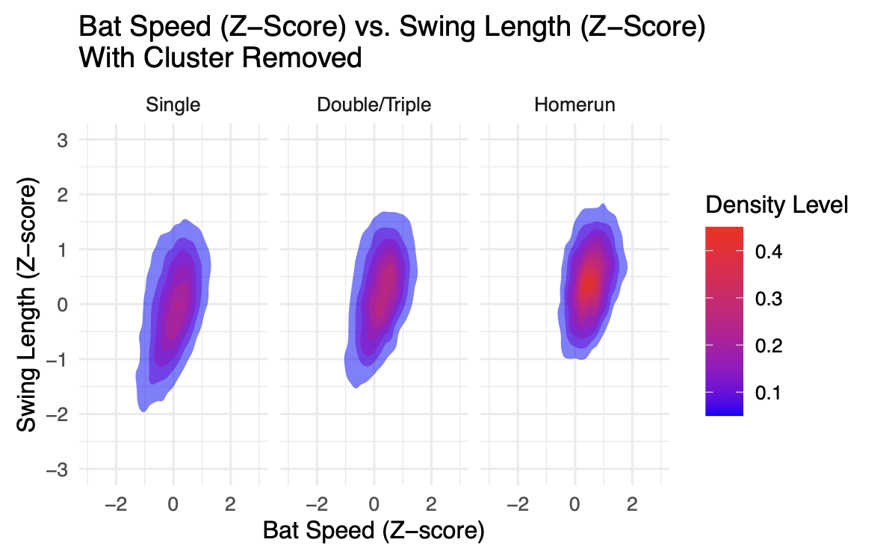

# Exploring MLB Batting Data Using Multinomial Logistic Regression
Vivian Johnson





# Introduction

Baseball is a competitive game that revolves around a defensive
(fielding) team and an offensive (hitting) team. The field is shaped
like a diamond, with each of the four corners representing first,
second, third, and home respectively. The game lasts nine innings, where
each inning is broken down into a top half (where one team hits and the
other is on defense) and a bottom half, where they switch. Each half
inning has three outs, and the objective of the hitting team is to score
runs while the fielding team attempts to stop them by getting outs.

The game begins when the pitcher on the defensive team throws the
baseball overhand from sixty feet to the batter, who tries to hit the
ball with their wooden bat from home plate to somewhere out of reach of
one of the eight other defensive players. Once the ball is hit, the
batter tries to reach as many bases as possible without getting out. The
winner at the end of the game is the team who scored the most runs.

For the purposes of this project, we look to analyze the different
mechanics that go into an at bat, and how those swing mechanics
differentiate based on what type of hit the batter gets. The diagram
below shows the set up of a baseball field, where all the defensive
players are positioned, as well as where the batter stands.


# Important Baseball Definitions

The terms below define key aspects of baseball that are relevant to this
project.

- **Ground Out:** The batter hits the ball on the ground, and the
  defensive player is able to throw the ball to first base before the
  batter gets there.
- **Pop Fly/Out:** The batter hits the ball in the air, and a defensive
  player catches the ball without letting it touch the ground.
- **Single:** A hit where the batter is able to make it safely to first
  base without stopping.
- **Double:** A hit where the batter is able to make it safely to second
  base without stopping.
- **Triple:** A hit where the batter is able to make it safely to third
  base without stopping.
- **Homerun:** A hit where the batter is able to make it around every
  base and back to home without stopping, usually done by hitting the
  ball over the homerun fence, positioned about 350 feet, depending on
  the ballpark played at.

# Theory

## Binary and Multinomial Classification

Classifying and predicting the type of hit that results from an at bat
can be described as a multinomial classification problem. Similar to
binary classification, where the response variable, Y, has two binary
categories, multinomial classification applies when there are multiple
possible event outcomes for Y. In this case, the possible results of the
hit are a single, double/triple (also referred to as an extra base hit),
or a homerun, encoded as 1, 2, or 3 respectively.

## Multinomial Logistic Regression

When predicting a response variable with more than two (binary) levels,
the multinomial logistic regression model is effective. Similar to
regular logistic regression, the multinomial logistic regression model
predicts the probability of each level of Y.

In this case, for the dependent variable, `hit_outcome`, we’re
interested in looking at the probabilities of different hits occurring,
which can be written as P(Y=j). This includes singles, extra base hits,
and homeruns. Using multinomial logistic regression, this can be modeled
by the following equation:


Where X_1 … X_5 indicate the various predictor variables for the
multinomial logistic regression model. Since we’re interested in the
probability of each hit given the different values of the five predictor
variables, we can transform the logit output from logistic regression to
the probability of the event occurring with the equation above.

## Accuracy, Precision, and Confusion Matricies

To evaluate the performance of the multinomial logistic regression
model, a confusion matrix can be used and from that, the measures of
accuracy and precision can be found. A confusion matrix is a table that
shows for each value of the dependent variable, the number of true
positives and negatives, as well as the false positives and negatives.
In this case, as there are three levels of the dependent variable, the
confusion matrix is a 3x3 table.

For each specific class of the dependent variable:

- **True Positives (TP):** The number of observations that are correctly
  identified as being a part of that class.
- **True Negatives (TN):** The number of observations that are correctly
  identified as not being a part of that class.
- **False Positives (FP):** The number observations that are incorrectly
  identified as being a part of that class.
- **False Negatives (FN):** The number of observations that are
  incorrectly identified as not being a part of that class.

From these metrics, accuracy (the accuracy in assigning the correct
categories to the data) can be defined as:


As there are some disadvantages of accuracy with the raw initial data
set, precision can also be used to evaluate the model for each level of
the response variable (i). Precision is the ratio of true positives to
all observations that were identified as positives in the model.


# Methods

The data used in this project comes from Baseball Savant, the clearing
house for the Statcast data provided by the Major League Baseball
Association (MLB). The MLB employs advance statistical software and
sports tracking in order to keep various statistics throughout the
entirety of a major league game. Baseball Savant acts as the dashboard
through which the public can view and access the data straight from the
MLB (Statcast (2024)).

## Initial Data Preparation

The data focuses on batting data from MLB games played from March 28,
2024 to October 30, 2024. The data was scraped from Baseball Savant
using the `statcast_search()` function from the `baseballr` package in
R[^1]. Once compiled, the data was saved to a CSV titled
`full_batting_data_2024.csv`.

``` r
# loading in the data 
batting_data_2024 <- read_csv("season_2024_batting_data.csv")
```

## Data Cleaning

The following code describes removing certain columns where data was no
longer collected and not useful to this project.

``` r
# renaming certain columns 
batting_data_2024 <- batting_data_2024 %>%
  rename(bat_speed = newStat_1,
         swing_length = newStat_2)

# removing deprecated columns 
batting_data_2024 <- batting_data_2024 %>%
  select(-spin_dir,
         -spin_rate_deprecated,
         -break_angle_deprecated,
         -break_length_deprecated,
         -tfs_deprecated,
         -tfs_zulu_deprecated,
         -umpire
         )
```

### Important Variables

**Table 1** gives descriptions of the variables used to create a model
and analyze hit types. The important variables considered in this
project are `events`, `release_speed`, `launch_angle`, `bat_speed`, and
`swing_length`.


### Indicator Variables


The indicator variable `hit_outcome` was created using the `events`
variable in the data set and serves as the dependent variable for
multinomial logistic regression. **Table 2**, and the code below
describe the variable, as well as creating it using the data, and
storing it in an R object called `batting_with_indicators`.

``` r
# making the indicator variables  
batting_with_indicators <- batting_data_2024 %>% 
  filter(
    !is.na(bat_speed) &
      !is.na(swing_length) &
      !is.na(launch_angle) &
      !is.na(release_speed)
    ) %>%
  mutate(
    # homerun variable: 1 if homerun, 0 if double 
    homerun = case_when(
      events == "home_run" ~ 1,
      events == "double" ~ 0,
      TRUE ~ NA_real_),
    # hit_outcome corresponds to the type of hit 
    hit_outcome = case_when(
      events == "home_run" ~ 3,
      events == "triple" | events == "double" ~ 2,
      events == "single" ~ 1)
    ) %>%
  filter(
    !is.na(hit_outcome)
    )
```

### Standardizing Variables

The next step in cleaning the data was to standardize the
`swing_length`, `bat_speed`, `launch_speed`, and `release_speed`
variables.

Turning these variables into z-scores was done to normalize the data so
that each variable has a mean of zero and a standard deviation of one.
Therefore, an observation with a `swing_length_zscore` of 0.56 would
indicate that that batter had a swing length 0.56 standard deviations
longer than the average swing length for all batters. This process puts
all observations for the variables on the same scale, and aids in the
interpretation of the regression models and comparison across variables.

``` r
# standardizing swing length, bat speed, and launch speed. 
batting_with_indicators <- batting_with_indicators %>%
  mutate(
    swing_length_zscore = scale(swing_length),
    bat_speed_zscore = scale(bat_speed),
    release_speed_zscore = scale(release_speed)
  )
```

## Preliminary Data Analysis

### Distributions of Independent Variables

 

**Figure 2** above, and **Figure 3** below, show the distributions of the independent
variables used during the model development process. From these figures,
we can see that all follow an approximately normal distribution.
Although multinomial logistic regression does not require normally
distributed independent variables, this approximate normality could aid
in interpretability. Additionally, this normality suggests that
transformations to the independent variables such as log or polynomial
terms might be unnecessary.


### Correlations

**Table 3** shows a correlation matrix for the independent variables.
The table includes standardized bat speed, standardized release score,
standardized swing length, and launch angle. The highest correlation is
between `bat speed` and `swing length`, with a value of 0.589. This
indicates a moderate positive correlation, which is logical, as higher
bat speeds tend to be associated with longer swing lengths.

Since this is the highest correlation, and other correlations are low,
multicollinearity does not appear to be a significant concern in the
data, given that none of the correlations are excessively high (above
0.8, which is usually considered to be an indicator of
multicollinearity).


### K Means Cluster Analysis


**Figure 4** shows a moderately positive linear relationship between the
standardized swing length of a batter and the standardized bat speed of
the batter. From this, it can be understood that longer swings tend to
produce higher bat speeds. A reasoning for this could be because with a
longer bat path, the batter has more time to generate speed in their
swing. Due to this, it was decided to add an interaction between bat
speed and swing length, as the effect of bat speed on hit outcome could
also be affected by the batter’s swing length.

The scatterplot in **Figure 4** also shows distinct grouping within the
data. There is a grouping of hits, most likely bunts[^2] or soft ground
balls, where the batters had much lower swing lengths and bat speeds
compared to the other observed hits. To analyze this further, K-means
cluster analysis was performed to look at the specific groupings in the
data.

K-Means Cluster Analysis is the process of grouping each observation in
the data based on distinct characteristics. Upon completion, groups will
be formed ideally with similar characteristics. The goal is to extract
relationships, in this case, between the swing length of the batter and
the bat speed. The algorithm begins by first determining how many groups
will be formed (K = 3 for this scenario). Then, 3 observations are
randomly chosen from the data, and assigned to a group. These rows act
as the preliminary centers (means) of the groups. The remaining
observations are individually assigned to the group that minimizes the
Euclidean distance[^3] between the observation and the group mean.
Following this, a new average for the groups are calculated, and each
observation is re-examined to see if it is closer to a different groups
average. This process repeats until no observation changes groups. (Wu
and Wu (2012))

The following code was used to perform the cluster analysis, while
**Figure 5** shows the corresponding groups that were created.

``` r
# selecting only the two columns needed
batting_cluster <- batting_with_indicators %>%
  select(swing_length_zscore,
         bat_speed_zscore)

set.seed(12) # so it is reproducible
cluster_analysis <- kmeans(batting_cluster,
                           centers = 3,
                           nstart = 25)
```

 


**Figure 5** shows the results from performing K=3 Means Cluster
Analysis. It is evident that the third cluster has significantly
different bat speeds and swing lengths. Because the goal of this project
is to examine the difference in hitting mechanics between true singles,
extra base hits, and homeruns, it was determined that these hits, which
are most likely check swings or bunts, don’t accurately represent the
data and that this cluster should be removed.

**Table 4** describes the cluster size, center, and within cluster sum
of squares for each group. The within cluster sum of squares, also known
as the intra-cluster variation, is the sum of the squared Euclidean
distances between each observation and the center of the cluster (Wu and
Wu (2012)). A smaller WSS indicates that the observations are grouped
closer together, thus forming a more specific group. Since the WSS of
group 3 is significantly lower than the other two groups and relatively
small, removing the observations in this group is not of high concern.

 

**Figure 6** shows the relationships
between standardized bat speed and standardized swing length for each
level of `hit_outcome` after removing the cluster of hits. For each hit
outcome, there is a clear positive relationship between the bat speed
and the length of the swing. The density level represents how closely
packed the points are, (i.e. where data points are more concentrated).
From **Figure 6**, we can see that the direction of the relationship
between the hit types are similar, but the densities and variance
differ. Home runs vary the least, as the majority of the observations
that are homeruns are tightly concentrated. Singles tend to vary the
most, as there is not an extremely high density level anywhere on the
graph. This is somewhat logical, as there is more opportunity / ways in
which a batter could hit a potential single compared to a homerun.

### Distributions Incorporating Ground Outs and Fly Outs

The data allows us to differentiate between fly outs and ground outs,
meaning that we can also observe the difference in the independent
variables between these types of outs, as well as hits. This is
important as it aids in understanding how these factors differ between
outs and hits.


**Figure 7** shows the distribution of launch angle for different hit
outcomes. For each at bat that resulted in an actual hit (a single,
double/triple, or a homerun), it is evident that the launch angles
follow a relatively normal distribution, being unimodal and centered
around the mean. There are no drastic changes in the spread of the data,
and no discernible U-shaped pattern. Using this, the decision to square
launch angle and use a quadratic term was not made, as it is probable
that it wouldn’t add much explanatory power to the model.

The side by side box plots in **Figure 7** also indicate that there does
seem to be a difference in average launch angle for each hit type. This
supports including `launch_angle` in the model, and that it would be
possible to have a model solely using it to predict `hit_outcome`, but
it wouldn’t explain everything. By bringing in fly outs and ground outs,
we can see how launch angle varies between the two as well. It makes
sense that the launch angle for ground outs would tend to be lower, as
it is likely that the ball was hit low on the ground to a fielder, and
the same goes for fly balls. Eventually, the launch angle on the ball is
too high and results in an out rather than a hit. While this is the
overall trend of these two specific results, the variation and spread of
the data is much larger.

It is important to note that it doesn’t make sense for `launch_angle` to
be negative for fly outs. As it is not one of the variables that is
standardized, a fly ball should have a positive launch angle, as that
would indicate that the ball went up in the air. After examining these
instances where the hit was recorded as a fly out and the launch angle
was negative, the conclusion was drawn that it was an error in recording
the data. This serves as another layer that makes modeling this data
more difficult.


Similar to **Figure 7**, **Figure 8** shows the distribution of each
standardized variable for each hit type, but also includes fly outs and
ground outs.

From these, there does seem to be differences in each variable depending
on the type of out, as well as differences in the variables depending on
the type of hit. The variable that seems the most constant is release
speed, and from that it can be drawn that the speed at which the pitch
is thrown matters less. However, release speed was still included in the
model because it aids in explaining information pertaining to the
pitcher during the at bat, and is not correlated with other variables
pertaining to the batter’s mechanics.

# Model Development

## Stage 1

The first stage of model development looks at simply creating logistic
regression models based on the available data. The first step of stage
one is to develop an initial model that will form the basis for the rest
of the analysis.

### Initial Model

The following code describes how to make the initial multinomial
regression model, where our goal is to predict `hit_outcome` from
`swing_length_zscore`, `bat_speed_zscore`, `release_speed_zscore`,
`launch_angle`, and an interaction between `bat_speed_zscore` and
`swing_length_zscore`.

``` r
reg_model_1 <- multinom(hit_outcome ~ 
                     swing_length_zscore +
                     bat_speed_zscore +
                     release_speed_zscore +
                     launch_angle +
                     bat_speed_zscore:swing_length_zscore,
                   data = batting_without_g3) 
```


**Table 5** shows the multinomial regression output for the initial
model. The bold coefficients represent those with a p-value that is
significant at the 0.01 level. Using this table, we can view the
coefficients for the model and understand how each contribute to the hit
outcome.

There are two columns for the regression table, and the coefficients in
each column represent the difference in log-odds resulting from a one
unit change in the predictor between the base group, (hitting a single)
and the corresponding hit column, which can be transformed into a
probability.

It is important to note that the output is currently in the logit form,
and must be converted to an odds ratio for an easier interpretation. We
can do this by taking the logit coefficient, and performing the
following calculation:


For example, `launch_angle` has a value of 0.065 in the double/triple
column. Once we calculate the odds ratio to be 1.067 We can interpret
this as follows:

***On average, a one degree increase in a batter’s launch angle is
associated with an increase in the odds of hitting a double or a triple
by a factor of 1.067***

Each interpretation is comparing the difference in odds between the base
group (which is hitting a single) and the corresponding group (in this
case, a double/triple). We can also interpret the interaction between
swing length and bat speed. With a logit coefficient of 0.09, we can
turn it into an odds ratio of 1.094 and understand it as:

***On average, for each standard deviation increase in a batter’s swing
length, the effect of standardized swing lenth on the odds of hitting a
doulbe/triple instead of a single increases by a factor of 1.094***

The interaction between bat speed and swing length suggests that as both
increase, the likelihood of hitting a double or triple increases
compared to a single. This is reflected in the positive interaction
term, indicating that the effect of swing length on the hit outcome is
enhanced as bat speed increases.

**Table 6** has interpretations for each ***odds ratio*** coefficient,
and we can use it to further understand the relationship that each
predictor variable has on the odds of hitting a double/triple or a
homerun compared to a single.


The package `emmeans` in R compares the estimated marginal means. In
this model, it allows us to see the differences in the average predicted
probabilities for each hit outcome.


**Table 7** shows the estimated probabilities for each hit outcome in
this model. Singles are estimated to occur the most, about 75.2% of the
time, followed by doubles and triples (22.6%), and the least likely to
occur are home runs (2.1%).

While hitting a single in a baseball game is more common than other
types of hits, there is still a stark difference in the probability of
each hit occurring. This is likely due to the imbalance in the data set,
with the model being more tailored to predicting singles because they
are much more prevalent in the data.

#### Decision Tree Initial Model

**Figure 9** shows a decision tree of the initial model. The
decision tree is a classification model that visualizes the steps that
the model goes through when attempting to classify each observation. The
nodes of the tree correspond to the decisions are made based on certain
thresholds or levels of the predictor variables. The branches represent
the outcome of the decision, or the comparison that was made, and the
leaves represent the final predicted outcome of the response variable.
The code below was used to generate the decision tree.

``` r
initial_decision_tree <- rpart(hit_outcome ~ 
                                 swing_length_zscore +
                                 bat_speed_zscore +
                                 release_speed_zscore +
                                 launch_angle,
                               data = batting_without_g3,
                               method = "class")
```


From **Figure 9**, we can see that classifying the type of hit mostly
relies on a hit’s launch angle and bat speed. The model starts with all
of the observations, and if the launch angle is less than 20, the hit is
automatically classified as a single. Of those hits, it represents $68$%
of the data, and of that, 81% were actually singles, 19% were actually
doubles/triples, and 0% were actually homeruns. The model continues to
make similar comparisons until all terminal nodes are reached.

**Figure 9** has four terminal nodes. **Table 8** shows the breakdown of
each terminal node. It shows the outcome the model predicted, the
percentage of the overall observations it makes up, as well as the
percent of those observations that were actually of other classes.


It is evident that the model over classifies singles out of the data and
doesn’t classify doubles/triples very well (only 6% are being classified
as doubles/triples). Among the terminal nodes for doubles/triples and
homeruns, there is still a large percentage of those that are being
incorrectly classified as singles.

### Balancing

While this model has some explanatory power, the coefficient estimators
are biased and inconsistent. This is due to the inherent class imbalance
among the different hit outcomes. Biased and inconsistent estimators are
those that skewed away from the true population average. **Table 9** is
a table corresponding to the relative sample sizes of each hit outcome
(single, extra base, or homerun).


Due to the fact that the sample size within the observed data for a
single is 23696, while doubles/triples and homeruns have 7772 and 5085
observations respectively, singles are going to contribute much more to
the overall model, thus causing the imbalance and bias towards
predicting the singles hit.

The singles hit in the data set are referred to as the majority class,
meaning they have the higher sample size and at this moment contribute
more to the model than the minority classes, the extra bases and the
homeruns. Intervention is necessary at this point to combat the
imbalance class size problem.

#### Existing Literature About Balancing

A part of this project revolves around the issue of an imbalanced data
set, the implications of it, and possible solutions. The purpose of this
section is to examine literature related to the class imbalance problem
and apply it to the model predicting `hit_outcome`.

As seen with the current batting data, a dataset is imbalanced if
different categories are not represented equally in the data. This can
lead to bias in the prediction model and flawed performance measures
(Chawla et al. (2002)). To combat this, multiple studies have been done
with the goal to develop various ways of balancing the data. Random
under sampling is the process of using random examples from the majority
class and taking them out of the dataset without replacement. This is
done until the dataset is roughly balanced. Random over sampling, on the
other hand, is the process of randomly sampling with replacement from
the category with less observations. This is also done until the data
set is somewhat balanced. (Thammasiri et al. (2014))

The effectiveness and performance of these processes are measured by the
accuracy, the error rate, sensitivity, and specificity generated from
each model’s respective confusion matrix. The confusion matrix displays
the true positives (TP) identified, false positives (FP), true negatives
(TN), and false negatives (FN) (Thammasiri et al. (2014)). These
performance measures are reliable for balanced data sets, but their
reliability decreases as more imbalance is introduced in the data set.
Thus, representing another reason as to why it’s important to have
balance. With the purpose of creating a more effective method to
balancing data rather than random under or over sampling, Chawla,
Bowyer, Hall, and Kegelmeyer created the Synthetic Minority Over -
Sampling (SMOTE) algorithm, which is a combination of under sampling of
the majority class and creating synthetic observations from the minority
class (Chawla et al. (2002)). SMOTE is another way to balance the
dataset so that one class doesn’t have a much larger impact on the data.
SMOTE is the process of adding artificially generated data to the
minority class, following the same distribution. This method of
oversampling takes its k nearest neighbor of the same minority class and
generates a new data observation between the k neighbors and the
observed observation. The `over_ratio` is a parameter that specifies
when SMOTE is terminated and represents the ratio of minority class
sample size to the majority class sample size. In this case, an
`over_ratio` of one means that now the data set is exactly balanced, all
classes have the same sample size (Chawla et al. (2002)).

SMOTE is important in improving the performance of the predictive model
because it offers more examples from the underrepresented group that
follow the distribution of the data, as opposed to random over sampling,
that takes already existing data points with no extra room for the model
to learn.

In their study comparing various types of prediction techniques for
dealing with imbalanced data, Thammasiri et al. (2014), was able to rank
the performance measures of logistic regression with oversampling,
logistic regression with under sampling, logistic regression with SMOTE,
and logistic regression with the original data. After performing 10-fold
cross validation on these different models, they found that logistic
regression using SMOTE performed better than random under sampling and
oversampling. While the original data model had high accuracy it’s
important to note that it could be biased and inconsistent because of
the imbalanced class sizes.

In conclusion, this literature provides useful evidence as to why the
current batting data is flawed, and a detailed approach on how to employ
the SMOTE algorithm to balance the data with the aim of creating a model
that can better predict the `hit_outcome` of an at bat.



### SMOTE Model

In order to use the SMOTE algorithm, the data needs to be cleaned
further. The code below describes this cleaning and formatting process,
and stores the data in an object called `smote_data`.

``` r
# Cleaning the data for SMOTE function 
smote_data <- batting_without_g3 %>%
  mutate(
    hit_outcome_factor = as.factor(hit_outcome)
  ) %>%
  select(swing_length_zscore,
         bat_speed_zscore,
         release_speed_zscore,
         launch_angle,
         hit_outcome_factor)
```

After the data is in the correct format, the SMOTE algorithm can be used
with the following code. The `over_ratio` of 0.8 indicates a roughly
balanced data set.

``` r
# running the SMOTE algorithm 
balanced_batting_data <-
  smote(
    smote_data,
    "hit_outcome_factor",
    k = 5,
    over_ratio = 0.8 # a roughly balanced data set 
  )
```

After balancing the data set, we can now run multinomial logistic
regression the same way as the initial model, except using the SMOTE
data set.

``` r
# logistic regression with the balanced data set 
reg_model_smote<- multinom(hit_outcome_factor ~
                          swing_length_zscore +
                          bat_speed_zscore +
                          release_speed_zscore +
                          launch_angle +
                          bat_speed_zscore:swing_length_zscore,
                        data = balanced_batting_data)
```

**Table 10** shows the multinomial regression output for the balanced
smote model. We can interpret the coefficients of the launch angle and
interaction term similarly to the interpretation for the initial model.


`launch_angle` has a value of 0.067 in the double/triple column. We can
interpret this as follows:

***On average, a one degree increase in a batter’s launch angle is
associated with an increase in the probability of hitting a double or a
triple by about 1.95%***

With a logit coefficient of 0.107, we can turn it into an odds ratio of
1.113 and understand the interaction between swing length and bat speed
as:

***On average, for each standard deviation increase in a batter’s swing
length, the effect of standardized swing length on the odds of hitting a
double/triple instead of a single increases by a factor of 1.113***

The interaction between bat speed and swing length suggests that as both
increase, the likelihood of hitting a double or triple increases
compared to a single. This is reflected in the positive interaction
term, indicating that the effect of swing length on the hit outcome is
enhanced as bat speed increases.

**Table 11** shows the interpretations for the coefficients of the SMOTE
model that were turned into odds ratios. This allows us to better
understand the relationship between the predictors and hit types. From
these, we can see that standardized bat speed as some of the most impact
on differentiating between singles and doubles, as well as singles and
homeruns. Release speed z-score has a negative effect on hitting a
double or triple compared a single, meaning that as pitch speeds get
higher, batters are less likely to hit a double or a triple.







**Table 12** shows the emmeans summary output for the estimated
probabilities of each hit type for the SMOTE model which uses a balanced
data set. After balancing the data, it can be noted now that there is
less of a difference in what hit type would be predicted, which should
be the case if there are relatively the same amounts of observations in
each class. While the odds of predicting a single decreased, it is
better for the overall model, as a lot of singles were being incorrectly
identified.



#### Decision Tree for SMOTE Model

The code below generates the decision tree using the balanced SMOTE
data, which is displayed in **Figure 10**.

``` r
smote_decision_tree <- rpart(hit_outcome_factor ~
                               swing_length_zscore +
                               bat_speed_zscore +
                               release_speed_zscore +
                               launch_angle,
                             method = "class",
                             data = balanced_batting_data)
```


Similar to the initial decision tree model, from **Figure 10**, we can
see that classifying the type of hit mostly relies on a hit’s launch
angle and bat speed. There are four terminal nodes. **Table 13** below
shows the breakdown of each terminal node. It shows the outcome the
model predicted, the percentage of the overall observations it makes up,
as well as the percent of those observations that were actually of other
classes.


After balancing the data, the decision tree does a better job at
classifying doubles/triples and homeruns. In this model, 57% of the
correctly identified doubles/triples were classified correctly, opposed
to 44% in the initial model, and the same is true for the homerun
category.

## Stage 2

The second stage of this project examines the predicted probabilities
from the multinomial logistic regression models by feeding them into a
decision tree. In a multinomial model, the predicted probabilities
represent the likelihood that an observation belongs to a certain class.
In this case, the predicted probabilities correspond to the likelihood
that each hit is a single, double/triple, or homerun. By feeding these
predicted probabilities into a decision tree model, we’re able to
identify patterns in how the probabilities map to certain classes, and
better understand the models.

### Initial Model

Below are the steps taken to feed predicted probabilities from a
training set of the initial model into a decision tree model.

1.  Getting how many rows are in the data and splitting into 2 parts

``` r
# so it is reproducible
set.seed(11)

# number of rows in dataset 
n_batting_initial = nrow(batting_without_g3)

# randomly take 80% of the rows for the training object 
train_initial = sample(1:n_batting_initial,
                   0.8*n_batting_initial,
                   replace=FALSE)
```

``` r
# split data into two parts - training 
batting_train_initial = batting_without_g3[train_initial,]
# part that isn't the training part
batting_test_initial = batting_without_g3[-train_initial,]
```

2.  Getting predicted probabilities from initial model on training data

``` r
# fitting the model on the training data 
reg_train_initial<- multinom(hit_outcome ~
                          swing_length_zscore +
                          bat_speed_zscore +
                          release_speed_zscore +
                          launch_angle +
                          bat_speed_zscore:swing_length_zscore,
                        data = batting_train_initial)

# getting predicted probabilities 
predicted_probs_initial <- predict(reg_train_initial,
                           newdata = batting_test_initial,
                           type = "probs")

# getting predicted classes 
predicted_class_initial <- predict(reg_train_initial,
                           newdata = batting_test_initial,
                           type = "class")
```

3.  Feeding the predicted probabilities into a decision tree

``` r
stage_2_tree_initial <- rpart(hit_outcome ~
                        predicted_probs_initial,
                      method = "class",
                      data = batting_test_initial)
```


**Figure 11** shows the how the predicted probabilities affect the
overall classification of the observation.
`predicted_probs_initial_tree3` represents the predicted probability
that the observation is a homerun. We can see that the model is only
using that predicted probability to classify the hits. If that
probability is less than 0.12, it is automatically classified as a
single. If it’s more than 0.12, it is compared again, this time to 0.31.
Any hit with a predicted probability less than 0.31 is classified as a
double/triple, and a probability greater than that is classified as a
homerun. The summary table below shows the percentages for each terminal
node.


**Figure 12** shows each of the density distributions for the
observations based on their predicted and actual class. By following a
specific column and row of the graph, you can look at combinations of
hits and the different predicted probabilities that were generated by
the model. The diagonal line of three graphs going through the center
correspond to hits that were correctly classified, while the
distributions around the diagonal line were incorrectly classified.

We can see from **Figure 12** that for hits that were actually
doubles/triples and were correctly classified as doubles/triples, there
is a high concentration of predicted probabilities ranging from
0.25-0.5, with a peak being around 0.35. This means that for hits that
were correctly classified as doubles/triples in the initial model were
all done so with less than 50% certainty. This graph can be used to
understand the ability of the model to be confident in certain
classifications.

### SMOTE Model

A similar process was done to the data used for the SMOTE model in order
to create a decision tree from the predicted probabilities based on that
data.

1.  Getting how many rows are in the data and splitting into 2 parts

``` r
# reproducibility 
set.seed(11)

# number of rows 
n_batting_smote = nrow(balanced_batting_data)

# randomly take 80% of the rows for the training object 
train_smote = sample(1:n_batting_smote,
                     0.8*n_batting_smote,
                     replace=FALSE)
```

``` r
# split data into two parts
batting_train_smote = balanced_batting_data[train_smote,]
# part that isn't the training part
batting_test_smote = balanced_batting_data[-train_smote,]
```

2.  Getting Predicted Probabilities from SMOTE Model on training data

``` r
# fitting the model on the training data 
reg_train_smote <- multinom(hit_outcome_factor ~
                          swing_length_zscore +
                          bat_speed_zscore +
                          release_speed_zscore +
                          launch_angle +
                          bat_speed_zscore:swing_length_zscore,
                        data = batting_train_smote)

# getting predicted probabilities 
predicted_probs_smote <- predict(reg_train_smote,
                                 newdata = batting_test_smote,
                                 type = "probs")

# getting predicted classes 
predicted_class_smote <- predict(reg_train_smote,
                                      newdata = batting_test_smote,
                                      type = "class")
```

3.  Feeding into decision tree the predicted probabilities

``` r
stage_2_tree_smote <- rpart(hit_outcome_factor ~
                              predicted_probs_smote,
                            method = "class",
                            data = batting_test_smote)
```


**Figure 13** shows the decision tree trained from the predicted
probabilities of the balanced SMOTE model. The model begins by looking
at if the predicted probability of the hit being a homerun
(`predicted_probs_smote3` \< 0.29). If that probability is greater than
or equal to 0.29, it is classified as a homerun. If it is less than
0.29, the model looks at the predicted probability being a single. If
that predicted probability is greater than 0.51 the observation is
classified as a single, if not, a double/triple. This model first
attempts to determine if a hit is a homerun or not, and then tries to
separate the singles from the doubles/triples. This strategy differs
from the initial model, which first decided if a hit was a single and
then compared the other types.


**Figure 14** shows the density graphs of the predicted probabilities
for the SMOTE model. The density distributions of hits that were
incorrectly classified tended to smooth out. However there are still
some instances where the model is consistently wrong. The model does a
poor job at distinguishing between a single and doubles/triples. This is
evident by the graphs where singles and doubles/triples were
misclassified as the other. For example, the observations that were
actually singles but were classified as doubles/triples has a high
density of predicted probabilities around 0.5, meaning that the model
was getting a high probability of the hit being a double/triple when it
was actually a single for the majority of hits that fall in that
category.

# Model Evaluation

The initial model attempts to classify the hit type using the
standardized swing length, standardized bat speed, standardized release
speed, launch angle, and an interaction between standardized bat speed
and standardized swing length. All predictors in the model are
significant and bat speed and swing length seem to contribute the most
to model.

The SMOTE model takes all of the same predictors, but uses different
data. The new balanced data has roughly the same amount of observations
among classes to prevent one class from creating bias. All predictors in
this model are significant and bat speed and swing length both
contribute the most to the model as well.

## Confusion Matrix Initial Model


**Figure 15** shows the confusion matrix for the initial multinomial
logistic regression model. The percentages in each box indicate the
percent of the total number of hits in that class the prediction makes
up. For example, 95.1% of the observed singles were correctly identified
as singles, while 2.1% of the observed doubles/triples were correctly
identified as doubles/triples and 69.9% of homeruns were correctly
classified as homerun. We can also use this confusion matrix to find
weak spots in the model. For example, 85.4% of all hits that were
actually doubles/triples were classified as singles, and 28.3% of
homeruns were classified as singles.

**Figure 15** provides evidence for the fact that because the initial
data set is so imbalanced, the model incorrectly identifies singles at
higher rates than any other hit. This is seen as the darkest colors,
indicating high percentages, and more concentrated in the predicted
singles column, and the percentages get lower everywhere else.

From the numbers behind the percentages of **Figure 15**, we can find
the accuracy as:


While accuracy is a respected metric for evaluating model performance,
it should not be the only one evaluated in a multinomial classification
model. This is because accuracy fails to take into account the number of
correctly identified observations of the other classes. It also fails to
account for class balance. For these reasons, it is also important to
look at precision for a certain level, $i$


As the precision measures indicate, the model is not precise at all in
predicting extra base hits and homeruns, and that the majority of the
accuracy comes from predicting singles.

## Confusion Matrix SMOTE Model


**Figure 16** shows how with the balanced data set, the model does a
better job at predicting hits that aren’t singles. While the percent of
singles that were correctly predicted declines, the trade off is a much
higher rate of doubles/triples that were correctly predicted, as well as
home runs. This is also evident in the precision calculations for each
level of the hit outcome. While the overall accuracy of the model
declines, we can see that the precision for the extra base hits and
homeruns are significantly higher compared to the initial model.

# Discussion and Implications


**Table 14** shows side by side comparisons of accuracy and precision
for each model. While the models aren’t perfect and there are inherent
issues with class balance, bias, accuracy, and precision, the SMOTE
model using synthetic data does a better job than the initial model
according to these metrics. There are still issues with classification,
as seen in the predicted probabilities. The SMOTE model is not extremely
accurate in distinguishing singles from doubles/triples, but does a
better job than the initial one. This inability could simply be from the
wide variation in ways a batter can hit a single, double/triple, which
makes modeling difficult. A main goal of this project is to see the
different impacts that certain mechanics have on the outcome of a swing,
and how players and coaches can use that to their advantage.



# References

<div id="refs" class="references csl-bib-body hanging-indent"
entry-spacing="0">

<div id="ref-chawla2002smote" class="csl-entry">

Chawla, Nitesh V, Kevin W Bowyer, Lawrence O Hall, and W Philip
Kegelmeyer. 2002. “SMOTE: Synthetic Minority over-Sampling Technique.”
*Journal of Artificial Intelligence Research* 16: 321–57.

</div>

<div id="ref-baseballr" class="csl-entry">

Petti, Bill, and Saiem Gilani. 2024. *Baseballr: Acquiring and Analyzing
Baseball Data*. <https://github.com/mlascaleia/baseballr>.

</div>

<div id="ref-baseballsavant" class="csl-entry">

Statcast, MLB. 2024. “Statcast Bat Tracking Leaderboard.” Major League
Baseball. <https://baseballsavant.mlb.com/leaderboard/bat-tracking>.

</div>

<div id="ref-thammasiri2014critical" class="csl-entry">

Thammasiri, Dech, Dursun Delen, Phayung Meesad, and Nihat Kasap. 2014.
“A Critical Assessment of Imbalanced Class Distribution Problem: The
Case of Predicting Freshmen Student Attrition.” *Expert Systems with
Applications* 41 (2): 321–30.

</div>

<div id="ref-wu2012cluster" class="csl-entry">

Wu, Junjie, and Junjie Wu. 2012. “Cluster Analysis and k-Means
Clustering: An Introduction.” *Advances in K-Means Clustering: A Data
Mining Thinking*, 1–16.

</div>

</div>

[^1]: Petti and Gilani (2024)

[^2]: A bunt is a strategic hit where the batter lightly taps the ball
    with the bat, usually to advance a runner already on base, or get on
    base quickly.

[^3]: Euclidean distance is the straight line distance between two
    points in space.
